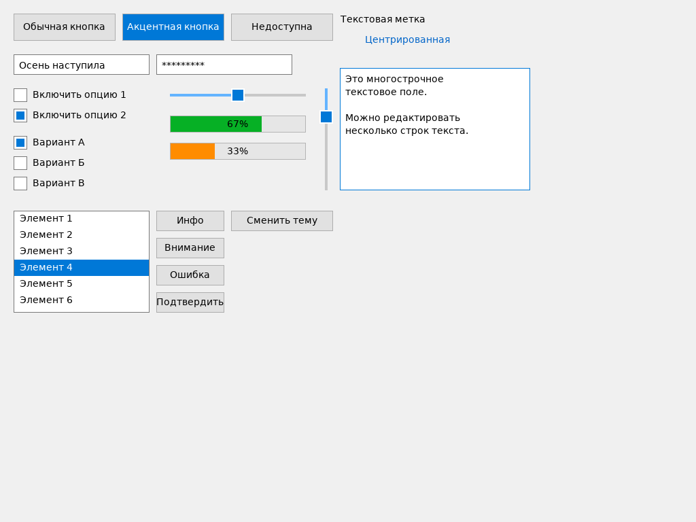
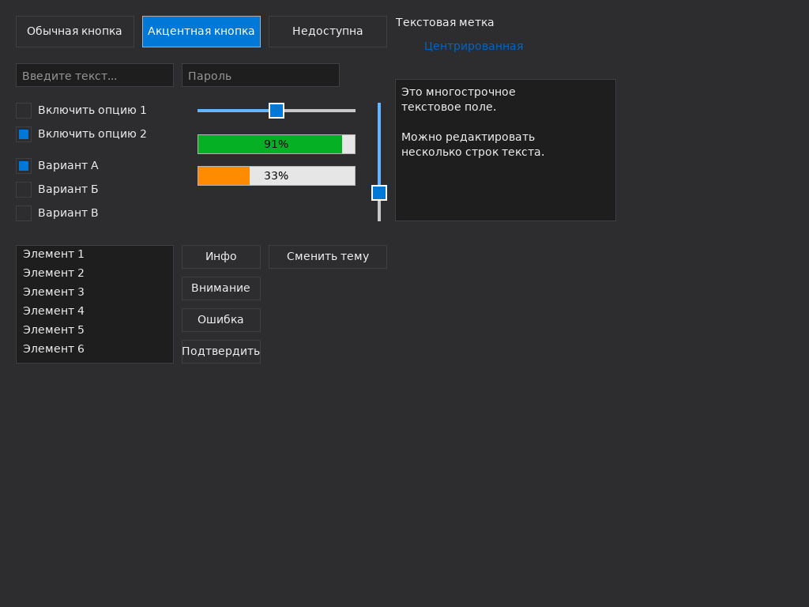

# sdlGuiLib

**Cross-platform GUI library based on SDL3 for the Nim language**

[](https://opensource.org/licenses/MIT)  
**Version:** 1.0  
**Last updated:** 2026-02-14  
**Author:** [github.com/Balans097](https://github.com/Balans097)  
**Dependencies:** [libSDL.nim](https://github.com/planetis-m/nim-sdl2) (SDL3 wrapper)

## Overview

`sdlGuiLib` is a lightweight, cross-platform graphical user interface library for Nim that uses **SDL3** as the rendering backend.


## How it looks on Fedora Linux
Light theme:

Dark theme:



Main goals:

- Easy integration into existing SDL3 applications
- Minimal external dependencies
- Reasonable out-of-the-box appearance
- Built-in light & dark themes
- Basic set of the most commonly used widgets

As of version 1.0 the library uses **absolute positioning** only — there is no built-in layout system (Flexbox, Grid, anchors, etc.).

## Features

- Light and dark themes included by default
- Blinking text cursor
- UTF-8 support (including emoji in most cases)
- Text selection (Shift+arrows, mouse drag, Ctrl+A/C/V/X)
- Modal dialog windows
- Basic mouse & keyboard event handling
- Password mode for text fields
- Simple focus & hover system

## Supported Widgets

| Widget          | Description                           | States                   | Main callbacks             | Status     |
|-----------------|---------------------------------------|--------------------------|----------------------------|------------|
| `Button`        | Standard push button                  | normal, hover, pressed   | `onClick`                  | ✓          |
| `TextField`     | Single-line text input                | normal, focused          | `onChange`, `onSubmit`     | ✓          |
| `TextArea`      | Multi-line text editor                | normal, focused          | `onChange`                 | ✓ (good)   |
| `CheckBox`      | Checkbox                              | normal, hover            | `onChange`                 | ✓          |
| `RadioButton`   | Radio button (grouped)                | normal, hover            | `onChange`                 | ✓          |
| `Slider`        | Horizontal / vertical slider          | normal, pressed          | `onChange`                 | ✓          |
| `ProgressBar`   | Progress indicator                    | —                        | —                          | ✓          |
| `Label`         | Static text label                     | —                        | —                          | ✓          |
| `Panel`         | Container / grouping widget           | —                        | —                          | ✓          |
| `ListBox`       | Simple item list                      | normal                   | `onSelect`                 | ✓          |
| `Dialog`        | Modal dialog window                   | —                        | `onClose`                  | ✓          |
| `ComboBox`      | Drop-down list                        | —                        | `onSelect`                 | ⚠ partial  |
| `SpinBox`       | Numeric spinner                       | —                        | `onChange`                 | ⚠ partial  |
| `TabControl`    | Tabbed interface                      | —                        | `onTabChange`              | —          |
| `Menu`          | Context / main menu                   | —                        | `onClick`                  | —          |
| `ToolBar`       | Toolbar                               | —                        | —                          | —          |
| `ToolTip`       | Hover tooltips                        | —                        | —                          | —          |

## Installation

```bash
# Assuming you already have SDL3 + libSDL.nim wrapper

nimble install https://github.com/Balans097/sdlGuiLib
# or
git clone https://github.com/Balans097/sdlGuiLib
cd sdlGuiLib
nimble develop
